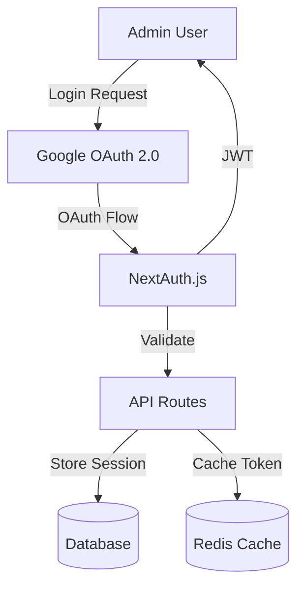
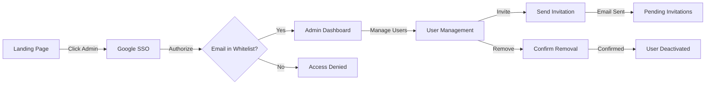

# Admin Authorization System Design

## Executive Summary

This document outlines the design and implementation plan for a comprehensive admin authorization system with Google SSO integration and granular privilege control for the Pavé restaurant platform.

## Table of Contents

1. [System Overview](#system-overview)
2. [Authentication Architecture](#authentication-architecture)
3. [Authorization Model](#authorization-model)
4. [SSO Integration](#sso-integration)
5. [Admin Management](#admin-management)
6. [Security Considerations](#security-considerations)
7. [Implementation Plan](#implementation-plan)
8. [Database Schema](#database-schema)
9. [API Endpoints](#api-endpoints)
10. [UI/UX Flow](#uiux-flow)

## System Overview

### Goals
- Implement secure Google SSO authentication for admin access
- Enable role-based access control (RBAC) with granular permissions
- Allow admins to invite and manage other administrators
- Maintain audit logs for all administrative actions
- Ensure zero-downtime migration from current authentication

### Key Features
1. **Google SSO Integration** - One-click login via Gmail accounts
2. **Multi-level Admin Roles** - Super Admin, Admin, Editor, Viewer
3. **Invitation System** - Email-based invitations with expiration
4. **Access Control** - Granular permissions per role
5. **Audit Trail** - Complete logging of all admin actions
6. **Session Management** - Secure token handling with refresh mechanism

## Authentication Architecture

### Components



### Authentication Flow

1. **Initial Login**
   ```
   User → Click "Login with Google" 
   → Redirect to Google OAuth
   → Authorize application
   → Callback to /api/auth/callback/google
   → Validate email against whitelist
   → Create/update user record
   → Generate JWT token
   → Set secure httpOnly cookie
   → Redirect to admin dashboard
   ```

2. **Session Management**
   - JWT tokens with 1-hour expiration
   - Refresh tokens with 30-day expiration
   - Automatic token refresh on API calls
   - Secure cookie storage (httpOnly, sameSite, secure)

## Authorization Model

### Role Hierarchy

```yaml
SuperAdmin:
  description: Full system control
  permissions:
    - admin.invite
    - admin.remove
    - admin.edit_roles
    - settings.all
    - menu.all
    - orders.all
    - analytics.all
    - audit.view

Admin:
  description: Restaurant management
  permissions:
    - admin.invite (Editor/Viewer only)
    - settings.edit
    - menu.all
    - orders.all
    - analytics.view

Editor:
  description: Content management
  permissions:
    - menu.edit
    - menu.create
    - orders.view
    - analytics.view

Viewer:
  description: Read-only access
  permissions:
    - menu.view
    - orders.view
    - analytics.view
```

### Permission Matrix

| Feature | SuperAdmin | Admin | Editor | Viewer |
|---------|------------|-------|--------|--------|
| Invite Admins | ✓ | ✓* | ✗ | ✗ |
| Remove Admins | ✓ | ✗ | ✗ | ✗ |
| Edit Settings | ✓ | ✓ | ✗ | ✗ |
| Manage Menu | ✓ | ✓ | ✓ | ✗ |
| View Orders | ✓ | ✓ | ✓ | ✓ |
| View Analytics | ✓ | ✓ | ✓ | ✓ |
| Audit Logs | ✓ | ✗ | ✗ | ✗ |

*Admin can only invite Editor/Viewer roles

## SSO Integration

### Google OAuth 2.0 Setup

1. **Google Cloud Console Configuration**
   ```javascript
   // Required OAuth 2.0 scopes
   const GOOGLE_SCOPES = [
     'openid',
     'email',
     'profile'
   ];

   // OAuth credentials
   const GOOGLE_CLIENT_ID = process.env.GOOGLE_CLIENT_ID;
   const GOOGLE_CLIENT_SECRET = process.env.GOOGLE_CLIENT_SECRET;
   const REDIRECT_URI = `${process.env.NEXTAUTH_URL}/api/auth/callback/google`;
   ```

2. **NextAuth.js Configuration**
   ```typescript
   // /apps/pave46/src/lib/auth.ts
   import NextAuth from 'next-auth';
   import GoogleProvider from 'next-auth/providers/google';
   import { PrismaAdapter } from '@auth/prisma-adapter';
   import { prisma } from '@restaurant-platform/database';

   export const authOptions = {
     adapter: PrismaAdapter(prisma),
     providers: [
       GoogleProvider({
         clientId: process.env.GOOGLE_CLIENT_ID!,
         clientSecret: process.env.GOOGLE_CLIENT_SECRET!,
         authorization: {
           params: {
             prompt: "consent",
             access_type: "offline",
             response_type: "code"
           }
         }
       })
     ],
     callbacks: {
       async signIn({ user, account, profile }) {
         // Check if user email is in whitelist
         const adminUser = await prisma.adminUser.findUnique({
           where: { email: user.email }
         });
         
         if (!adminUser || adminUser.status !== 'ACTIVE') {
           return false; // Deny access
         }
         
         // Log successful login
         await prisma.auditLog.create({
           data: {
             userId: adminUser.id,
             action: 'LOGIN',
             details: { provider: 'google', ip: req.ip }
           }
         });
         
         return true;
       },
       async jwt({ token, user, account }) {
         if (user) {
           const adminUser = await prisma.adminUser.findUnique({
             where: { email: user.email },
             include: { role: true }
           });
           
           token.userId = adminUser.id;
           token.role = adminUser.role.name;
           token.permissions = adminUser.role.permissions;
         }
         return token;
       },
       async session({ session, token }) {
         session.user.id = token.userId;
         session.user.role = token.role;
         session.user.permissions = token.permissions;
         return session;
       }
     },
     pages: {
       signIn: '/auth/signin',
       signOut: '/auth/signout',
       error: '/auth/error',
       verifyRequest: '/auth/verify'
     },
     session: {
       strategy: 'jwt',
       maxAge: 30 * 24 * 60 * 60, // 30 days
     }
   };
   ```

## Admin Management

### Invitation System

1. **Invite Flow**
   ```typescript
   // POST /api/admin/invite
   interface InviteAdminRequest {
     email: string;
     role: 'ADMIN' | 'EDITOR' | 'VIEWER';
     restaurantId: string;
     expiresAt?: Date; // Default: 7 days
   }

   // Process:
   // 1. Validate requester permissions
   // 2. Check if email already exists
   // 3. Create invitation record
   // 4. Send invitation email
   // 5. Log action in audit trail
   ```

2. **Invitation Email Template**
   ```html
   Subject: You've been invited to manage Pavé

   Hello,

   You've been invited to join the Pavé admin team as an {role}.

   Click here to accept the invitation:
   {invitationUrl}

   This invitation will expire in 7 days.

   If you didn't expect this invitation, please ignore this email.
   ```

3. **Acceptance Flow**
   ```
   User clicks invitation link
   → Redirect to Google OAuth
   → Verify email matches invitation
   → Create AdminUser record
   → Set role from invitation
   → Mark invitation as accepted
   → Redirect to dashboard
   ```

### Admin Removal

1. **Removal Process**
   ```typescript
   // DELETE /api/admin/users/{userId}
   
   // Checks:
   // - Requester must be SuperAdmin
   // - Cannot remove self
   // - Cannot remove last SuperAdmin
   
   // Actions:
   // 1. Soft delete (set status = 'INACTIVE')
   // 2. Revoke all active sessions
   // 3. Log action in audit trail
   // 4. Send notification email
   ```

2. **Protection Rules**
   - Minimum 1 SuperAdmin required
   - Cannot remove own account
   - All removals are soft deletes
   - 30-day grace period for restoration

## Security Considerations

### Best Practices

1. **Token Security**
   - Use secure, httpOnly, sameSite cookies
   - Implement CSRF protection
   - Short-lived access tokens (1 hour)
   - Rotate refresh tokens on use

2. **Rate Limiting**
   ```typescript
   // Rate limit configuration
   const rateLimits = {
     login: '5 requests per 15 minutes per IP',
     invite: '10 requests per hour per user',
     api: '100 requests per minute per user'
   };
   ```

3. **Audit Logging**
   ```typescript
   interface AuditLog {
     id: string;
     userId: string;
     action: AuditAction;
     targetId?: string;
     details: JsonValue;
     ipAddress: string;
     userAgent: string;
     timestamp: Date;
   }

   enum AuditAction {
     LOGIN = 'LOGIN',
     LOGOUT = 'LOGOUT',
     INVITE_SENT = 'INVITE_SENT',
     INVITE_ACCEPTED = 'INVITE_ACCEPTED',
     ADMIN_REMOVED = 'ADMIN_REMOVED',
     ROLE_CHANGED = 'ROLE_CHANGED',
     SETTINGS_UPDATED = 'SETTINGS_UPDATED',
     MENU_UPDATED = 'MENU_UPDATED'
   }
   ```

4. **Security Headers**
   ```typescript
   // middleware.ts
   const securityHeaders = {
     'X-Frame-Options': 'DENY',
     'X-Content-Type-Options': 'nosniff',
     'X-XSS-Protection': '1; mode=block',
     'Referrer-Policy': 'strict-origin-when-cross-origin',
     'Content-Security-Policy': "default-src 'self'; script-src 'self' 'unsafe-inline' apis.google.com;"
   };
   ```

## Implementation Plan

### Phase 1: Foundation (Week 1)
- [ ] Set up Google Cloud project and OAuth credentials
- [ ] Install and configure NextAuth.js
- [ ] Create database schema for admin users and roles
- [ ] Implement basic Google SSO login

### Phase 2: Authorization (Week 2)
- [ ] Implement RBAC middleware
- [ ] Create permission checking utilities
- [ ] Add role-based route protection
- [ ] Build admin user management API

### Phase 3: Admin Management (Week 3)
- [ ] Build invitation system
- [ ] Create admin management UI
- [ ] Implement email notifications
- [ ] Add audit logging

### Phase 4: Testing & Security (Week 4)
- [ ] Security audit and penetration testing
- [ ] Load testing for SSO endpoints
- [ ] Documentation and training materials
- [ ] Migration from existing auth system

## Database Schema

```prisma
model AdminUser {
  id            String      @id @default(cuid())
  email         String      @unique
  googleId      String?     @unique
  name          String?
  avatar        String?
  roleId        String
  status        UserStatus  @default(ACTIVE)
  invitedById   String?
  lastLoginAt   DateTime?
  createdAt     DateTime    @default(now())
  updatedAt     DateTime    @updatedAt
  
  role          AdminRole   @relation(fields: [roleId], references: [id])
  invitedBy     AdminUser?  @relation("InvitedUsers", fields: [invitedById], references: [id])
  invitedUsers  AdminUser[] @relation("InvitedUsers")
  sessions      Session[]
  auditLogs     AuditLog[]
  invitations   Invitation[]
  
  @@index([email])
  @@index([status])
  @@map("admin_users")
}

model AdminRole {
  id            String      @id @default(cuid())
  name          String      @unique
  description   String?
  permissions   String[]    // Array of permission strings
  isSystem      Boolean     @default(false) // Cannot be deleted
  createdAt     DateTime    @default(now())
  updatedAt     DateTime    @updatedAt
  
  users         AdminUser[]
  
  @@map("admin_roles")
}

model Invitation {
  id            String      @id @default(cuid())
  email         String
  roleId        String
  invitedById   String
  token         String      @unique
  expiresAt     DateTime
  acceptedAt    DateTime?
  status        InviteStatus @default(PENDING)
  createdAt     DateTime    @default(now())
  
  role          AdminRole   @relation(fields: [roleId], references: [id])
  invitedBy     AdminUser   @relation(fields: [invitedById], references: [id])
  
  @@index([email])
  @@index([token])
  @@index([status])
  @@map("invitations")
}

model Session {
  id            String      @id @default(cuid())
  userId        String
  token         String      @unique
  refreshToken  String?     @unique
  expiresAt     DateTime
  ipAddress     String?
  userAgent     String?
  createdAt     DateTime    @default(now())
  
  user          AdminUser   @relation(fields: [userId], references: [id], onDelete: Cascade)
  
  @@index([token])
  @@index([userId])
  @@map("sessions")
}

model AuditLog {
  id            String      @id @default(cuid())
  userId        String?
  action        String
  targetId      String?
  targetType    String?
  details       Json?
  ipAddress     String?
  userAgent     String?
  createdAt     DateTime    @default(now())
  
  user          AdminUser?  @relation(fields: [userId], references: [id], onDelete: SetNull)
  
  @@index([userId])
  @@index([action])
  @@index([createdAt])
  @@map("audit_logs")
}

enum UserStatus {
  ACTIVE
  INACTIVE
  SUSPENDED
}

enum InviteStatus {
  PENDING
  ACCEPTED
  EXPIRED
  REVOKED
}
```

## API Endpoints

### Authentication Endpoints
```yaml
POST   /api/auth/signin         # Initiate Google OAuth
GET    /api/auth/callback/google # OAuth callback
POST   /api/auth/signout        # Logout
GET    /api/auth/session        # Get current session
POST   /api/auth/refresh        # Refresh token
```

### Admin Management Endpoints
```yaml
GET    /api/admin/users         # List all admin users
GET    /api/admin/users/:id     # Get admin user details
POST   /api/admin/invite        # Send invitation
DELETE /api/admin/users/:id     # Remove admin
PATCH  /api/admin/users/:id/role # Change user role
GET    /api/admin/invitations   # List pending invitations
DELETE /api/admin/invitations/:id # Revoke invitation
GET    /api/admin/audit-logs    # View audit logs
```

### Protected Routes Middleware
```typescript
// /apps/pave46/src/middleware/auth.ts
import { withAuth } from 'next-auth/middleware';

export default withAuth({
  callbacks: {
    authorized: ({ req, token }) => {
      const path = req.nextUrl.pathname;
      
      // Public routes
      if (path.startsWith('/api/auth')) return true;
      
      // Protected routes
      if (path.startsWith('/admin')) {
        if (!token) return false;
        
        // Check specific permissions
        if (path.startsWith('/admin/users')) {
          return hasPermission(token, 'admin.manage');
        }
        
        if (path.startsWith('/admin/settings')) {
          return hasPermission(token, 'settings.edit');
        }
        
        return true; // General admin access
      }
      
      return true;
    }
  }
});
```

## UI/UX Flow

### Admin Dashboard Components

1. **User Management Page**
   ```tsx
   // /apps/pave46/src/app/admin/users/page.tsx
   
   Features:
   - List of all admin users with roles
   - Search and filter capabilities
   - Invite new admin button
   - Role management dropdown
   - Last login information
   - Remove admin action (with confirmation)
   ```

2. **Invitation Modal**
   ```tsx
   // /apps/pave46/src/components/admin/InviteAdminModal.tsx
   
   Fields:
   - Email address (with validation)
   - Role selection dropdown
   - Custom message (optional)
   - Expiration date picker
   - Send invitation button
   ```

3. **Audit Log Viewer**
   ```tsx
   // /apps/pave46/src/app/admin/audit/page.tsx
   
   Features:
   - Filterable action log
   - User activity timeline
   - Export to CSV
   - Date range selector
   - Action type filter
   ```

### User Experience Flow



## Environment Variables

```env
# Google OAuth
GOOGLE_CLIENT_ID=your-client-id.apps.googleusercontent.com
GOOGLE_CLIENT_SECRET=your-client-secret
GOOGLE_REDIRECT_URI=http://localhost:3000/api/auth/callback/google

# NextAuth
NEXTAUTH_URL=http://localhost:3000
NEXTAUTH_SECRET=your-nextauth-secret

# Email Service (for invitations)
SMTP_HOST=smtp.gmail.com
SMTP_PORT=587
SMTP_USER=notifications@pave.com
SMTP_PASSWORD=your-smtp-password
EMAIL_FROM=Pavé Admin <admin@pave.com>

# Security
SESSION_MAX_AGE=86400 # 24 hours in seconds
INVITATION_EXPIRY=604800 # 7 days in seconds
MAX_LOGIN_ATTEMPTS=5
RATE_LIMIT_WINDOW=900 # 15 minutes in seconds
```

## Testing Strategy

### Unit Tests
```typescript
// Test cases for authorization
describe('Authorization System', () => {
  test('SuperAdmin can invite any role');
  test('Admin can only invite Editor/Viewer');
  test('Editor cannot invite users');
  test('Cannot remove last SuperAdmin');
  test('Cannot remove self');
  test('Expired invitations are rejected');
  test('Duplicate invitations are prevented');
});
```

### Integration Tests
```typescript
// E2E tests with Playwright
describe('Admin Management Flow', () => {
  test('Complete invitation flow');
  test('Google SSO login');
  test('Role-based access control');
  test('Admin removal process');
  test('Audit log creation');
});
```

### Security Tests
- SQL injection attempts
- XSS vulnerability scanning
- CSRF token validation
- Rate limiting verification
- Session hijacking prevention

## Migration Strategy

### From Current Auth to SSO

1. **Phase 1: Parallel Systems**
   - Deploy SSO alongside existing auth
   - Allow both login methods
   - Migrate admin accounts gradually

2. **Phase 2: SSO Primary**
   - Make SSO the default login
   - Keep password login as fallback
   - Monitor for issues

3. **Phase 3: SSO Only**
   - Disable password login
   - Archive old auth code
   - Full SSO adoption

## Support & Maintenance

### Monitoring
- Login success/failure rates
- Invitation acceptance rates
- Session duration metrics
- API response times
- Error rates by endpoint

### Alerts
- Failed login attempts > threshold
- Unusual admin activity patterns
- Expired SSL certificates
- OAuth token refresh failures
- Database connection issues

### Documentation
- Admin user guide
- API documentation
- Security best practices
- Troubleshooting guide
- Recovery procedures

## Conclusion

This authorization system provides enterprise-grade security with user-friendly management capabilities. The Google SSO integration simplifies login while maintaining strict access control. The invitation system allows controlled growth of the admin team with full audit trails for compliance.

### Next Steps
1. Review and approve design
2. Set up Google Cloud project
3. Begin Phase 1 implementation
4. Schedule security review
5. Plan user training sessions

---

*Document Version: 1.0*  
*Last Updated: 2024*  
*Author: System Architecture Team*